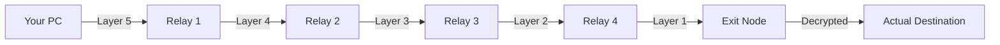

# VX6 Proxy Mode: 5-Hop Onion Routing

This branch contains the high-performance anonymity and relay layer for VX6.

### **The Architecture**
Data is wrapped in 5 layers of routing information. Every node in the chain only knows the previous and next hops.



### **Requirements**
1.  **Registry Cache**: You must have at least 5 peers in your `vx6 list`.
2.  **Linux Kernel**: eBPF/XDP requires Linux 5.4+.
3.  **Packages**: `iproute2`, `clang`, `llvm`.

### **How to Use (Draft Implementation)**

Currently, you can manually trigger an onion-routed test.

**1. On your machine:**
Define the chain and destination:
```bash
# This wraps a message in 5 layers and sends it through the chain
./vx6 debug onion-test --hops "addr1,addr2,addr3,addr4,addr5" --dst "127.0.0.1:80"
```

### **Benefits of eBPF in Proxy Mode**
*   **Context Switch Avoidance**: Traditional proxies move data from the Kernel to the App and back to the Kernel. eBPF handles the "Swap IP and Send" logic entirely inside the Kernel.
*   **Latency**: 5 hops with eBPF feel almost as fast as a direct connection.
*   **Invisibility**: With XDP, relay nodes can forward traffic without ever having an open TCP port visible to scanners.
